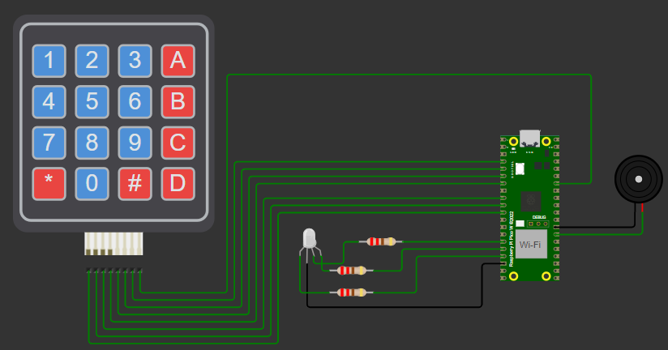
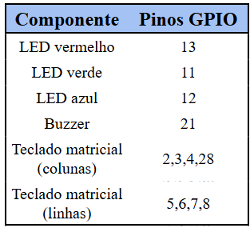
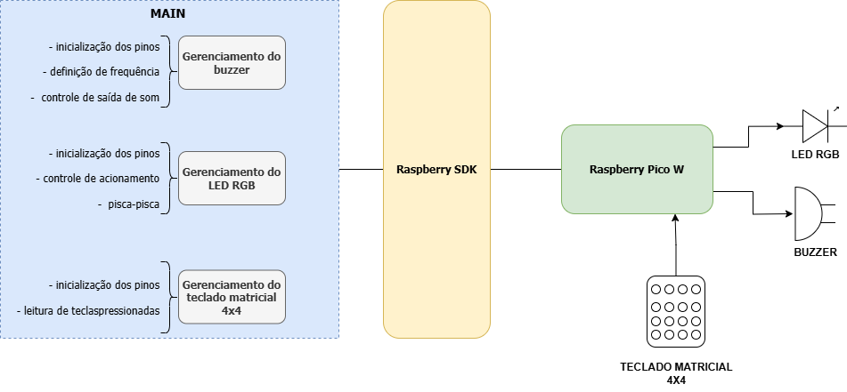

<h1 align="center">Controle de buzzer e LED RGB por meio de teclado matricial para Raspberry Pico W</h1>

## Sobre o projeto

O vídeo a seguir apresenta uma expplicação breve sobre o projeto.

> 
> ...

## Colaboradores

### Líder

### Desenvolvedores

## Funcionalidades

A partir do teclado matricial, pode-se controlar o LED RGB e o buzzer piezoelétrico. Cada uma das teclas executa uma rotina de acionamento diferente. As Figuras 1 e 2 listam as teclas e suas respectivas funcionalizadas.

  <figure>  
    
    <figcaption>
      
 

**Figura 1** - Rotinas de acionamento para as teclas 0 a 7

    </figcaption>
  </figure>

  <figure>  
    
    <figcaption>
      
 

**Figura 2** - Rotinas de acionamento para as demais teclas

    </figcaption>
  </figure>

## Circuito implementado

Para o desenvolvimento deste projeto, os seguintes componentes foram utilizados:
- 1 LED RGB;
- 3 resistores de 220 ohm;
- 1 teclado matricial 4x4;
- 1 buzzer piezoelétrico;
- 1 Raspberry Pi Pico W.

A Figura 3 apresenta o circuito implementado por meio da ferramenta de simulação Wokwi para VSCode. Por sua vez, Figura 4 lista a relação dos pinos utilizados para cada um dos componentes.

  <figure>  
    
    <figcaption>
      
 

**Figura 3** - Circuito implementado no Wokwi para VSCode

    </figcaption>
  </figure>

  <figure>  
    
    <figcaption>
      
 

**Figura 4** - Relação de pinos utilizados

    </figcaption>
  </figure>

## Arquitetura do projeto

A Figura 5 apresenta o diagrama em blocos da arquitetura do projeto. O software embarcado conta com três blocos principais para o genrenciamento dos componentes eletrônicos: gerenciamento do LED RGB, gerenciamento do buzzer piezoelétrico e gerenciamento do teclado matricial. Cada uma deltes blocos utiliza a [Raspberry Pi SDK](https://github.com/raspberrypi/pico-sdk) para realizar a comunicação com a plataforma Raspberry Pi Pico W e os respectivos componentes conectados a ela.

  <figure>  
    
    <figcaption>
      
 

**Figura 5** - Diagrama em blocos do projeto

    </figcaption>
  </figure>

A Figura 6 apresenta o fluxograma simplificado do software embarcado implementado. Primeiramente, os pinos utilizados para o controle dos componentes eletrônicos são inicializados e configurados. Após, a rotina de detecção de teclas pressionadas é iniciada. Caso um pressionamento seja identificado, a respectiva rotina de acionamento é executada e, em seguida o programa retorna para a rotina de leitura de teclas. Caso contrário, o programa reinicia o processo de detecção. A fim de corrigir o fenômeno de bouncing das teclas, um atraso de 200 ms foi adicionado ao loop mais externo do programa (loop principal).

  <figure>  
    
    <figcaption>
      
 

**Figura 6** - Fluxograma simplificado do software implementado

    </figcaption>
  </figure>

